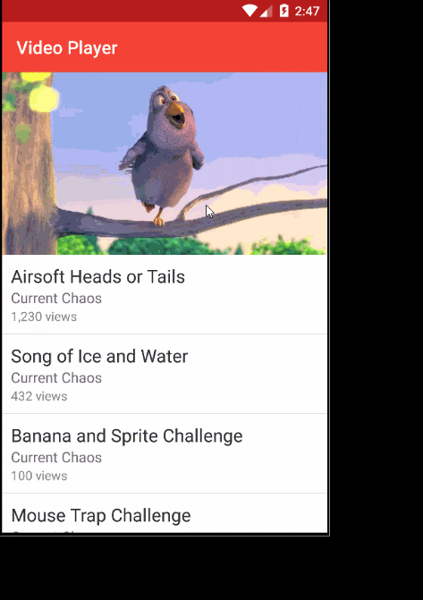

# NativeScript Video Player :clapper:
A NativeScript plugin to provide an XML widget for playing local and remote video files.

#### Platform controls used: 
Android | iOS
---------- | -----------
[Android VideoView](http://developer.android.com/intl/zh-tw/reference/android/widget/VideoView.html) |  [iOS AVPlayer](https://developer.apple.com/library/prerelease/ios/documentation/AVFoundation/Reference/AVPlayer_Class/index.html)


## Sample Usage




## Installation
From your command prompt/terminal go to your app's root folder and execute:

`npm install nativescript-videoplayer`

## Usage

###
```XML
<Page xmlns="http://schemas.nativescript.org/tns.xsd"
      xmlns:VideoPlayer="videoplayer">
        <StackLayout>
            <VideoPlayer:Video
            src="~/videos/small.mp4"
            loaded="videoplayerLoaded" 
            finished="videoFinished" 
            autoplay="true" 
            height="300" />

            <!-- Remote file to test with https://clips.vorwaerts-gmbh.de/big_buck_bunny.mp4 -->
            
        </StackLayout>
</Page>
```

## Attributes
**src** - *required*

Attribute to specify the video file to play, for best performance use local video files if possible. The file must adhere to the platforms accepted video formats. For reference check the platform specs on playing videos.

**autoplay - (boolean)** - *optional*

Attribute to set if the video should start playing as soon as possible or to wait for user interaction.

**finished - (function)** - *optional*

Attribute to specify an event callback to execute when the video reaches the end of its duration.

### Contributors

- Alex Ziskind [@digitalix](https://twitter.com/digitalix)
- Nathanael Anderson [@CongoCart](https://twitter.com/CongoCart)
